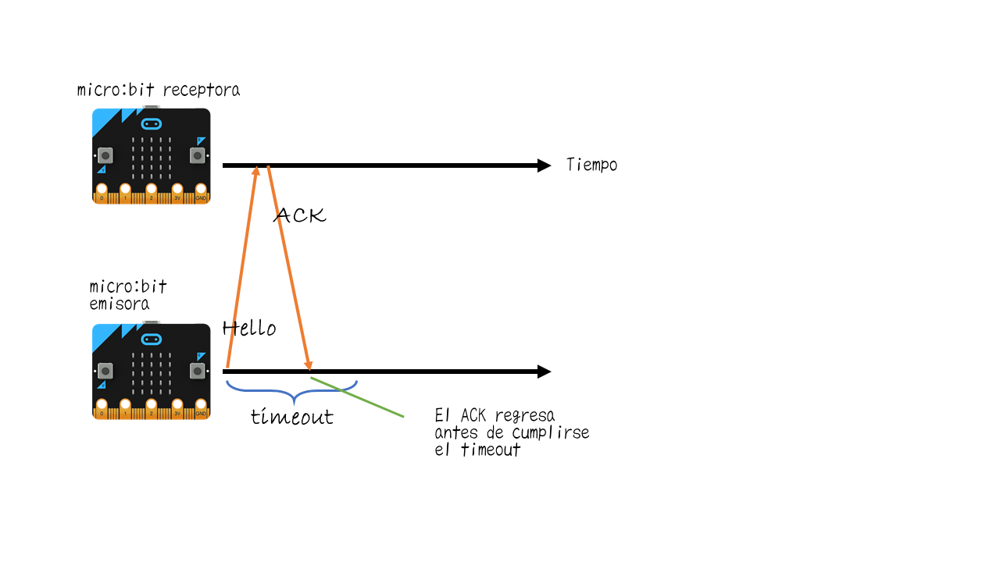
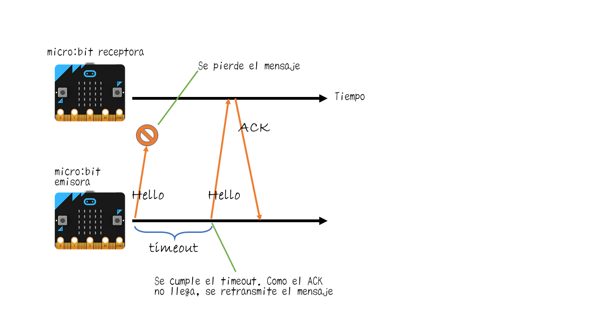
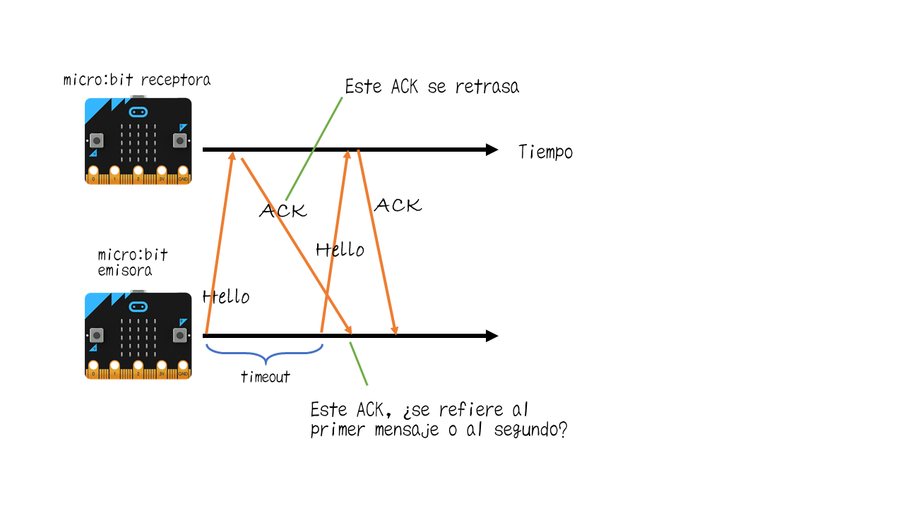

Gestionar errores: acuse de recibo
==================================

Introducción
------------

En el capítulo anterior usamos retransmisiones para gestionar los errores de transmisión. En este capítulo vamos a ir un paso más allá al usar acuses de recibo (acknowledgements o ACKs, en inglés). Y en el proceso vamos a aprender varios métodos y protocolos fundamentales para el control de errores en las redes de ordenadores.

Resumiendo, vas a aprender:

- El concepto de *acuse de recibo*

- El concepto de *Solicitud de repetición automática* o *Automatic Repeat Request (ARQ)*

- El protocolo *parada-y-espera*

### Necesitarás

    2 micro:bits
    1 colega

Antecedentes
------------

En el capítulo anterior, un mensaje se transmitía varias veces sin importar si el receptor ya había recibido una copia previamente. ¡Eso es un desperdicio! El emisor podría haber transmitido nueva información en lugar de volver a enviar estos mensajes repetidos. Y también es un incordio para el receptor, que tiene que descartar mensajes duplicados.

Para evitarlo vamos a introducir un concpeto llamado *acuse de recibo*.

!!! hint "Definición 1: _Acuse de recibo (ACK)_"
	Un acuse de recibo es un mensaje breve que el receptor envía para avisar al emisor de que recibió un mensaje. El emisor entonces se da cuenta de que no es necesario retransmitir, y estaría ya listo para enviar el siguiente mensaje.
	
Si el emisor no recibe un acuse de recibo, solo entonces retransmitiría su mensaje.

Pero, claro, ¿cuánto tiempo debería esperar el emisor a que le llegue el acuse de recibo? Esto se determina mediante un *timeout*.

!!! hint "Definición 2: _Timeout_"
	Un timeout es el tiempo permitido que puede pasar antes de que el emisor deje de esperar un acuse de recibo.
	
En otras palabras, si el emisor no recibe un acuse de recibo dentro del periodo de timeout, pensará que el paquete debe haberse perdido.

Los acuses de recibo se utilizan en un método de control de errores que se llama *Solicitud de repetición automática* o *Automatic Repeat Request (ARQ)*.

!!! hint "Definición 3: _Solicitud de repetición automática (ARQ)_"
	Solicitud de repetición automática es un método de control de errores. Utiliza acuses de recibo y timeouts para retransmitir paquetes. Las retransmisiones pueden continuar hasta que el emisor recibe un acuse de recibo o bien hasta que un número máximo de retransmisiones se ha alcanzado.
	
ARQ se usa tanto en internet como en redes móviles. 

En su implementación más sencilla ARQ utiliza el protocolo de *Parada-y-Espera*

!!! hint "Definición 4: _Protocolo Parada-y-Espera_"
	En el protocolo de *Parada-y-Espera* el emisor:

	1. envía un paquete
	2. espera hasta que le llega el acuse de recibo (ACK) o se rinde después de que se cumpla el timeout
	3. si se cumple el timeout, va al paso 1
	4. si le llega el ACK, prepara un nuevo paquete y va al paso 1.

En el protocolo *Parada-y-Espera* el emisor, por tanto, no puede enviar un nuevo paquete hasta que recibe el ACK del paquete anterior.

La siguiente figura muestra un ejemplo de retransmisión exitoso. El emisor envía "Hola" y el receptor responde con un ACK. El emisor recibió el ACK antes de que se cumpliera el timeout, así que sabe que el paquete se recibió bien. Por tanto, en ese momento el emisor puede empezar en enviar otro mensaje.

!!! note ""
	**Figura 1:** Protocolo ARQ Parada-y-Espera: El receptor envía un ACK al emisor para que el emisor sepa que el mensaje "Hola" llegó correctamente.

Ahora vamos a ver algunos casos con errores. La figura de abajo muestra que el primer mensaje se pierde. Así que el receptor no envía el ACK. Cuando se cumple el timeout el emisor no ha recibido un ACK. Por tanto, retransmite el mensaje. El segundo intento sí tiene éxito, y el emisor recibe el ACK a tiempo (antes de cumplirse el timeout).

!!! note ""
	**Figura 2:** Protocolo ARQ Parada-y-Espera: El mensaje se pierte, así que el emisor retransmite.

La figura siguiente muestra un ejemplo en el que el mensaje enviado por el emisor se recibe correctamente, pero el ACK enviado por el receptor se pierde. De nuevo, cuando se cumple el timeout el emisor no ha recibido el ACK. Así que retransmite el mensaje. El receptor recibe mensaje duplicado y, de nuevo, envía el ACK. Esta vez el segundo ACK llega con éxito y las cosas continúan con normalidad.

!!! note ""
	**Figura 3:** Protocolo ARQ Parada-y-Espera: El mensaje se recibe, pero el ACK se pierde, así que el emisor retransmite.
	
Estos ejemplos muestran que el protocolo ARQ Parada-y-Espera maneja las pérdidas de paquetes de datos y ACKs bastante bien. Sin embargo, ¿siempre funciona? La figura de abajo muestra un problema que puede ocurrir cuando los ACKs se retrasan. En otras palabras, los timeouts se cumplen antes de que los ACKs puedan ser recibidos. En este ejemplo cuando el emisor envía el primer "Hola" el receptor recibe el mensaje y envía un ACK de vuelta. Pero el timeout se cumple antes de que el emisor reciba el ACK. Así que retransmite el segundo "Hola". Y justo después, el emisor recibe el ACK retrasado. Pero, ¿a qué paquete se refiere este ACK? ¿Al primer "Hola" o al segundo? ¡Y esto es confuso también para el receptor! ¿El segundo "Hola" es un nuevo paquete o un duplicado?

!!! note ""
	**Figura 4:** Protocolo ARQ Parada-y-Espera: ¿Qué ocurre si un mensaje se retrasa? No está claro a qué mensaje se refiere el ACK.

Para resolver esta confusión el protocolo necesita usar números de secuencia.

!!! hint "Definición 5: _Número de secuencia_"
	Un número de secuencia es un número escogido por el emisor, e incluido en la cabecera del paquete. Cuando el receptor envía un ACK incluye el número de secuencia para decirle al emisor que recibió el paquete anterior y que está listo para el siguiente.

Por ejemplo, si el emisor envía "Hola, 0", significa que es un mensaje "Hola" con un número de secuencia 0. Al recibir este paquete el receptor enviaría "ACK, 1", que significa "he recibido el paquete 0, puedes enviarme el paquete 1". No vamos a usar números de secuencia en las tareas de esta lección, pero podrías tratar de añadirlos como actividad de extensión.

A programar: ¡Para y espera!
----------------------------

Para programar el protocolo ARQ Parada-y-Espera vas a trabajar con un colega. Del mismo modo que en el tema [Gestionar errores: Retransmisiones](../retransmissions/retransmissions.md), vamos a usar los bloques a medida *ErrorRadio* para enviar mensajes con errores. La comunicación es unicast, así que usaras direcciones origen y destino en tus mensajes, como ya hicimos en el tema [Comunicación unicast: de una a una](../unicast/unicast.md). No olvides que al recibir un mensaje hay que comprobar si la dirección destino que viene en el paquete es la de la placa en cuestión.

### Tarea 1: Diseña tus paquetes de datos y ACKs

**Descripción:** Antes de que puedas enviar ningún paquete es necesario que decidas el formato de los paquetes de datos y de los ACKs.

**Instrucciones:** Debatid en grupo cuál es la información mínima que deberían contener los paquetes. Cread dos variables para los paquetes de datos y los ACKs haciendo uso de los bloques de Texto en el editor de bloques JavaScript.

### Tarea 2: Timeout y retransmisiones

**Descripción:** Para programar la Parada-y-Espera vas a necesitar un mecanismo de timeout. Tras cada envío necesitas esperar a que te llegue bien el ACK o a que se cumpla el timeout. La decisión principal que tenéis que tomar es cuál será la duración del timeout.

**Instrucciones:** Para esta tarea puedes empezar desde cero o puedes también partir del código que programaste en las tareas del tema [Gestionar errores: Retransmisiones](../retransmissions/retransmissions.md). En la placa emisora tienes que programar cómo esperar al ACK. En el menú "Básico" está la función "pausa", que puede ser muy útil para el mecanismo de timeout. Si la pausa termina antes de que recibas el ACK hay que retransmitir el paquete. Si recibes el ACK antes de que termine la pausa, tienes que recordar esta información para que al terminar la pausa envíes el sigiuente paquete (sin retransmitir el anterior).

Para probar el programa hay que programar también el receptor. El receptor envía un paquete ACK por cada paquete de datos que recibe.

### Tarea 3: probar la fiablidad de la Parada-y-Espera

**Descripción:** En esta tarea vas a experimentar con el protocolo Parada-y-Espera que habéis programado. Para ello hay que añadir un contador en la placa emisora para contar el número de retransmisiones. En la micro:bit receptora necesitas mostrar por pantalla los mensajes recibidos y un contador para comprender el efecto de los ACKs en las retransmisiones.

**Instrucciones:** Decide cuánto tiempo va a ser la pausa del timeout. Tienes que enviar 5 números a la otra micro:bit siguiendo el protocolo. Primero usarás una tasa de error de 25, y luego de 75. Repetid el experimento tres veces. 

En la tabla de abajo las retransmisiones son el número de veces que un paquete necesitó ser reenviado. Los duplicados son el número de veces que el receptor recibió retransmisiones innecesarias. Así que, por ejemplo, supongamos que tras la ejecución del protocolo el emisor envió lo siguiente:

       1 1 1 2 2 3 4 4 4 4 5 5

Esto significa que hubo 7 retransmisiones. Y el receptor recibió lo siguiente:

       1 2 2 3 4 5 5

Por tanto, se recibieron dos duplicados. La primera fila de la tabla se ha rellenado con los datos del ejemplo. Tras ejecutar tus experimentos, rellena las siguientes filas de la tabla. Al comparar las retransmisiones y los duplicados, debatid si el protocolo funciona bien para gestionar errores.

| **Valor del error** | **Experimento nª.** | **Retransmisiones** | **Duplicados** |
|-----------------|:-------------------|:--------------------|:---------------|
| 25 | (ejemplo) | 7 | 2|
| 25 | 1 | | |
| 25 | 2 | | |
| 25 | 3 | | |
| 75 | 1 | | |
| 75 | 2 | | |
| 75 | 3 | | |

Actividades de ampliación
-------------------------

!!! attention "Ejercicio 1"
	¿Funcionan mejor los acuses de recibo que usar solamente retransmisiones? En cualquier caso, ¿le veis algunos problemas a los acuses de recibo?

!!! attention "Ejercicio 2"
	¿Cómo afecta la duración del timeout al protocolo? Por ejemplo, ¿qué ocurre si el timeout es muy corto, o muy largo? ¿Qué pasa si se retrasan los ACKs?

!!! attention "Ejercicio 3"
	Investigad cómo funciona el "Protocolo de bits alternos", que usa un número de secuencia de 1 bit para ayudar con los problemas discutidos en las figuras de la sección "Antecedentes".

Problemas
--------

1. ¿Qué significa ARQ?

2. En el protocolo ARQ Parada-y-Espera, si se envían 10 paquetes, ¿cuántos ACKs hay que enviar?

Recursos
--------

Vídeo: Internet: paquetes, enrutamiento y fiabilidad -
    <https://youtu.be/AYdF7b3nMto>
