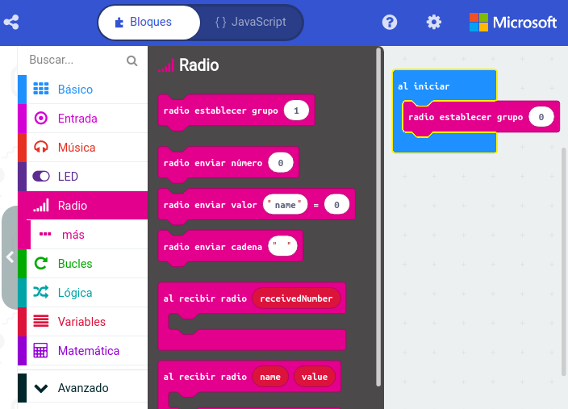

Comunicación broadcast: De uno a todos
======================================

Introducción
------------

La comunicación inalámbrica (radio), como por ejemplo el WiFI o los teléfonos móviles, es una forma popular de conectarse a Internet. En el capítulo [Comunicación por cables](../wiredcommunication/wiredcommunication.md), ya conectaste dos placas micro:bits usando cables. Hoy las conectaremos usando las radios.

En el proceso no solo aprenders a utilizar la radio de tu micro:bit; también aprenderás acerca de la comunicación broadcast (o difusión).  Las comunicaciones inalámbricas suelen ser broadcast; es decir, una micro:bit puede enviar mensajes a todas las micro:bits. 

Resumiendo, este capítulo nos servirá para aprender:

- comunicación *inalámbrica* y cómo configurar la radio de las placas micro:bit

- el concepto de *broadcast* y *dirección broadcast*

- envir y recibir distintos tipos de mensajes (por ejemplo, un número o un texto) utilizando broadcast

- en qué ocasiones resulta útil utilizar broadcast y en cuáles no

### Qué necesitas

    2 micro:bits
    2 soportes para pilas y 4 pilas AAA
    1 colega

Antecedentes
------------

La comunicación inalámbrica utiliza radiación electromagnética (ondas de radio y microondas) para enviar información. Las ondas de radio son esencialmente ondas electromagnéticas que se emiten desde una antena (como las antenas de un router WiFi). Por tanto, la comunicación inalámbrica es siempre broadcast, en el sentido de que las señales enviadas, por ejemplo, por un router WiFI pueden ser escuchadas por cualquier dispositivo WiFi sintonizado en la misma frecuencia de radio.

!!! hint "Definición 1: _Broadcast_"
	En redes, la comunicación broadcast (o de difusión) significa que el mensaje enviado por un remitente se transmite a todos los receptores en una red.

Pero, ¿significa esto que la comunicación broadcast solo es posible con las comunicaciones inalámbricas? No, pero es más engorroso. Por ejemplo, en la comunicación por cable la comunicación broadcast es posible repitiendo el mismo mensaje en todos los cables.

Finalmente, los receptores pueden negarse a recibir mensajes de difusión si no están etiquetados con una *dirección de broadcast*.

!!! hint "Definición 2: _Dirección broadcast_"
	Una dirección broadcast (o de difusión) es una dirección especial que indica que todos los dispositivos de la red deberían recibir este mensaje.

En estos ejercicios con las placas micro:bit la dirección broadcast se va a configurar estableciendo el ID de grupo de la radio de micro:bit. Por tanto, todas las placas micro:bits deben tener el mismo ID de grupo para que la comunicación broadcast funcione. 

¡A programar!: Recibir y enviar mensajes broadcast
--------------------------------------------------

En esta actividad vas a a prender a recibir mensajes, y también a enviar mensajes broadcast que lleguen a todas las micro:bits.

La placa del profe es la que va a enviar los mensajes que tienes que tratar de recibir. 

### Tarea 1: Configura la radio de tu placa

**Descripción:** Para la comunicación broadcast necesitamos que todas las micro:bits tengan el mismo ID de grupo de radio. Este identificador será la dirección de broadcast. Es algo parecido a lo que hacemos cuando sintonizamos el canal correcto para recibir una transmisión de televisión o una emisora de radio.

**Instrucciones:** Programa tu micro:bit estableciendo el ID de grupo de radio a 0. Para ello tendrás que usar un bloque del menú Radio, como se muestra en la figura a continuación. Puedes aprender más sobre bloques de radio en <https://makecode.microbit.org/reference/radio>.

!!! note ""
	**Figura 1:** Establecer el ID de grupo de radio en MakeCode

### Tarea 2: Recibir mensajes broadcast

**Descripción:** En esta tarea vas a programar tu micro:bit para recibir mensajes broadcast enviados desde otra placa. En este caso, será la placa del profe la que envíe los mensajes broadcast.

A la hora de escribir tu programa para recibir mensajes hay dos cosas que tienes que tener en cuenta.

1. ¿Qué bloques del editor vas a tener que usar para poder recibir un mensaje a través de la radio?

2. Haciendo uso de estos bloques, ¿puedes recibir cualquier tipo de mensaje -como por ejemplo un número o un texto?

**Instrucciones:** Primero, programa tu micro:bit para que pueda recibir un número. La placa del profe está preparada para enviar mensajes con un número del 0 and 9, así que tu programa debe recibir el mensaje y mostrar por pantalla el número recibido. Cuando lo hayas programado, avisa al profe para que puedas probar tu programa.

Cuando hayas conseguido el paso anterior, vas a programar tu micro:bit para que también pueda recibir un texto. De nuevo, programa tu micro:bit para recibir mensajes de texto y mostrar el texto recibido. Cuando la hayas programado, avisa al profe para que puedas probar tu programa. ¿Qué palabra has recibido?

### Tarea 3: Enviar mensajes de broadcast

**Descripción:** Ahora es tu turno para enviar mensajes broadcast. Como somos varios grupos en clase, y cada grupo enviará mensajes broadcast, verás que vas a recibir un montón de mensajes. ¿Es posible saber quién ha enviado cada mensaje?

**Instrucciones:** Programa tu micro:bit para que envíe un número al presionar el botón A y envíe un texto al presionar el botón B. 

Un pasito más allá
------------------

!!! attention "Ejercicio 1"
	Amplía el programa realizado en la tarea 2 que permite recibir un texto. Ahora tu placa mostrará una cara “Triste” hasta que reciba un mensaje con el texto “Hola”. En ese momento mostrará una cara “Alegre” durante dos segundos.

	
Preguntas finales
------------------

1. Reflexiona sobre algunos problemillas que tiene la comunicación broadcast. ¿Siempre es necesario o útil enviar mensajes a todo el mundo? ¿Qué pasa con la privacidad? ¿Puede ser problemático que todo el mundo reciba todos los mensajes?

2. ¿Es más fácil enviar mensajes broadcast en redes cableadas o inalámbricas? ¿Por qué?
