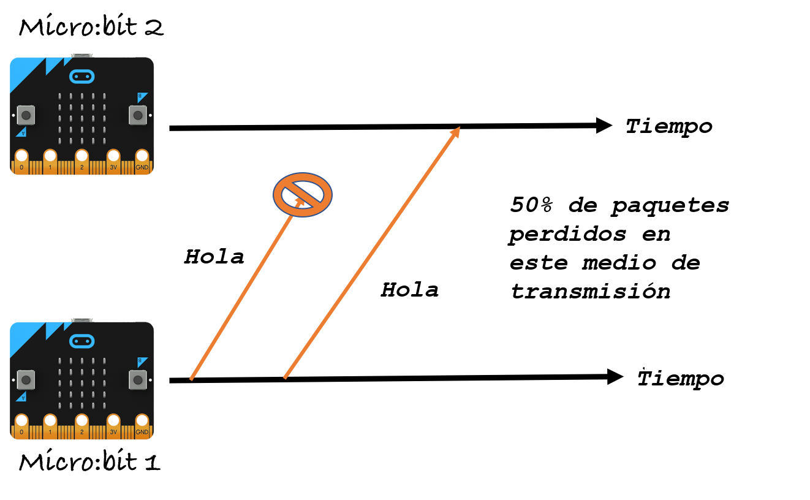

Gestionar errores: retransmisiones
==================================

Introducción
------------

En los capítulos anteriores es probable que hayas notado que la comunicación inalámbrica no es siempre fiable. En otras palabras, puede que no todos los mensajes que se envían sean recibidos por el otro extremo. En este capítulo aprenderemos a incrementar la probabilidad de que nuestros mensajes sean recibidos. ¿Qué podríamos hacer si un mensaje se pierde? En esta práctica veremos un método simple pero efectivo: las retransmisiones.

En resumen, aprenderás sobre:

- Errores en comunicaciones inalámbricas

- *Retransmisiones* como un método de fiabilidad.

### Qué necesitas

    2 micro:bits
    1 colega

Antecedentes
------------

En las comunicaciones inalámbricas un error se puede producir por varios motivos. Por ejemplo, si hay obstáculos físicos como muros, puertas o incluso personas. Las señales inalámbricas pierden fuerza al atravesar estos obstáculos y a veces incluso rebotan en ellos.

Cuantos más obstáculos haya entre emisor y receptor mayor es la probabilidad de que ocurra un error. Además si emisor y receptor están muy alejados puede que no sean capaces de comunicarse. Imagina que hay un montón de obstáculos entre dos personas que se estén hablando; puede que no siempre puedan escuchar lo que el otro está diciendo.

Otra causa de errores inalámbricos pueden ser las *interferencias de radio*. Esto se debe a que la comunicación inalámbrica es broadcast (acuérdate de lo que vimos en el capítulo de [Comunicación broadcast](../broadcast/broadcast.md)). Esto significa que pueda haber mucha gente enviando mensajes, y sus transmisiones puede colisionar en los receptores. Es decir, que los emisores están *interfiriendo* unos con otros.

!!! hint "Definición 1: _Interferencia_"
	En comunicación inalámbrica una interferencia es cualquier otra señal que interrumpe una señal mientras viaja hacia su destino.
	
Imagina en una clase en la que todo el mundo está hablando a la vez. Seguro que no te enterás de la mitad de las cosas que esté diciendo tu compañero. Las señales de otras personas están interfiriendo con la señal de tu compañero en su camino hacia ti. En redes, esto se llama pérdida de paquetes.

!!! hint "Definición 2: _Pérdida de paquetes_"
	La pérdida de paquetes ocurre cuando uno o más paquetes que viajan en una red de ordenadores no llegan a su destino. La pérdida de paquetes se mide como la proporción de paquetes perdidos y paquetes enviados (echa un ojo a la fórmula de abajo).

*Pérdida de paquetes* = (*Paquetes perdidos*)/(*Paquetes enviados*)

Por otra parte es posible que si hay mucha interferencia se puedan recibir mensajes con errores. Por ejemplo podría ocurrir que escucharas "guapo" cuando tu compañero en realidad ha dicho "guarro". En redes esto se llama paquetes con errores. 

!!! hint "Definición 3: _Tasa de paquetes con errores_"
	La tasa de paquetes con errores es la proporción de paquetes que se han recibido con uno o más errores y los paquetes enviados.
	
*Tasa de paquetes con errores* = (*Paquetes con errores*)(*Paquetes enviados*)

En este capítulo veremos un método simple para gestionar estos errores, las *retransmisiones*, por las que el emisor retransmite automáticamente mensajes muchas veces para incrementar la probabilidad de recepción.

!!! hint "Definición 4: _Retransmisiones_"
	Retransmisiones significa enviar mensajes muchas veces. 

En la Figura de abajo asumiremos que el emisor sabe que el medio de transmisión pierde la mitad de los paquetes que se envían. En otras palabras, la tasa de pérdida de paquetes es 0,5 (50%). La micro:bit emisora decide enviar cada paquete dos veces para incrementar la probabilidad de que el mensaje llegue al destino. El primer paquete es la transmisión, y el segundo paquete es la retransmisión. Así que el número de retransmisiones es 1.

!!! note ""
	**Figura 1:** Las retransmisiones pueden incrementar el éxito de los mensajes. En el ejemplo, el emisor envía un mensaje dos veces por defecto. Así que, a pesar de que el primer "Hola" falla, el segundo "Hola" sí es recibido por el receptor.

Es habitual utilizar retransmisiones combinadas con otros métodos. Por ejemplos, el emisor podria retransmitir solo cuando está seguro de que ha ocurrido un error. Esta opción se explora en el próximo capítulo, [Gestionar errores: ACKs](../acknowledgements/acknowledgements.md).

A programar: Retransmisiones 
----------------------------

Esta actividad hay que hacerla con un colega. En la tarea 1 epezarás creando paquetes de errores, y luego en la tarea 2 probaremos diferentes tasas de error. En la tarea 3 programaremos la solución de las retransmisiones para tratar con los errores. Y a lo largo de las tareas se proponen diferentes experimentos para medir realmente cómo de bien funcionan las retransmisiones.

### Tarea 1: Crear errores en paquetes

**Descripción:** En comunicación inalámbrica los paquetes pueden fallar de manera aleatoria. Y claro, esto hace que realizar pruebas en tu código para este capítulo sea complicado. Para probar los errores vamos a usar un bloque a medida en el editor de bloques de JavaScript para enviar mensajes con errores.

Los bloques de ErrorRadio son como los que estamos acostumbrados a usar de Radio, pero tienen un parámetro extra, *error*. Este parámetro está definido a 20 por defecto, lo que significa que la tasa de paquetes con errores es 0,2 o 20%.

!!! note ""
	**Figura 2:** Bloques a medida Error radio

**Instrucciones** Para usar los bloques a medida en el editor de JavaScript hay que importar el archivo [ErrorRadio.hex](https://microbit.nominetresearch.uk/networking-book/ErrorRadio.hex) en el sitio web de MakeCode. Ahora tenéis que decidir qué placa micro:bit será la emisora y cuál la receptora. Sigue el enfoque del capítulo [Unicast: de una a una](../unicast/unicast.md) para escribir las direcciones origen y destino en los paquetes. Quizás incluso puedes copiar y modificar uno de los programas que ya escribiste en ese capítulo, para incluir ahora los bloques de *ErrorRadio*.

En el emisor, escribe un programa que envíe un número usando el bloque que realiza envíos con errores. Descarga el programa a la micro:bit. En el receptor escribe un programa que recibe un número y lo muestra en la pantalla. Descarga el programa en la otra micro:bit.

Cambia en tu programa la tasa de paquetes con errores usando por turnos los siguientes valores: 0, 50 y 100. Prueba a enviar varios números y comprobar con cada tasa si se cumple lo esperado al ver los mensajes mostrados en el receptor. 

### Tarea 2: Envía una secuencia de mensajes

**Descripción:** En esta sección enviarás una secuencia de mensajes a la micro:bit receptora.

**Instrucciones:** Amplía el programa de la tarea 1 para que se envíe esta secuencia:

    Inicio 1 2 3 4 5 6 7 8 9 10 Fin

Puedes enviar los mensajes *Inicio* y *Fin* utilizando los bloques de radio para que se envíen sin errores. Pero recuerda que la radio de nuestra micro:bit es posible que pierda involuntariamente algunos mensajes. Así que puede que ocurra algún error al enviar *Inicio* y *Fin*... ¡ninguna radio es perfecta!

Amplía el programa de la micro:bit receptora para contar el número de mensajes que recibe en esta secuencia. Ejecuta el experimento estableciendo el parámetro de error primero a 25, luego a 50 y luego a 75. Calcula la tasa de pérdida de paquetes utilizando la ecuación que vimos antes. Repite el experimento tres veces. Rellena la tabla de debajo con los resultados de tus experimentos. Por ejemplo, cuando el *error* se establece a 25 en el experimento primero, si recibes:

    Inicio 1 5 6 7 8 9 10 Fin

Esto significa que has recibido 7 paquetes y que has perdido 3. Tu tasa de pérdida de paquetes es 0,3. La primera fila de la tabla se ha rellenado en base a este ejemplo. Rellena la tabla con los valores de tu experimento. Y en base a vuestros resultados, discutid entre los compañeros cómo han cambiado los resultados al modificarse el valor de *error* en el bloque de envío. 

| **Valor de error** | **Experimento nº** | **Paquetes recibidos**| **Pérdida de paquetes** |
|-----------------|:-------------------|:---------------|:-----------------|
| 25 | (Ejemplo) | 7| 0,3
| 25 | 1 | | |
| 25 | 2 | | |
| 25 | 3 | | |
| 50 | 1 | | |
| 50 | 2 | | |
| 50 | 3 | | |
| 75 | 1 | | |
| 75 | 2 | | |
| 75 | 3 | | |

Tarea 3: Retransmitir por defecto
---------------------------------

**Descripción:** En esta tarea, vas a programar retransmisiones automáticas en el lado del emisor.

**Instrucciones:** Cambia el código de la Tarea 2 para enviar cada paquete de la secuencia más de una vez. Para probar el código establece el valor de *error* a 75. Por ejemplo, si fijamos el número de retransmisiones a 1, tendríamos que enviar la siguiente secuencia:

    Inicio 1 1 2 2 3 3 4 4 5 5 6 6 7 7 8 8 9 9 10 10 Fin

Esto significa que se enviaría 20 paquetes en total, incluyendo 10 retransmisiones.

Cambia el código del receptor para contar el número de paquetes únicos recibidos. Cuenta también los duplicados recibidos. Calcula la pérdida de paquetes. Por ejemplo, supongamos que has recibido la siguiente secuencia para el caso de 1 retransmisión:

    Inicio 1 1 2 3 5 5 6 8 9 9 10 Fin

Esto significa que el receptor ha recibido 8 números únicos (1, 2, 3, 5, 6, 8, 9 y 10) y 3 duplicados (1, 5 y 9). Por tanto, fíjate que aunque la tasa de pérdida de paquetes es 9 de 20 (45%), al utilizar retransmisiones el receptor solo ha perdido 2 números de los 10 (el 4 y el 7 son los que no recibió). Vamos a llamar a esta tasa *pérdida de información*. Así que la pérdida de información es 0,2. La primera fila de la tabla de abajo se ha rellenado en base a este ejemplo.

Ejecuta el experimento tres veces para los distintos valores de retransmisión y rellena el resto de la tabla.

| **Retransmisiones** | **Experimento** | **Páquetes únicos recibidos**| **Duplicados** |**Pérdida de paquetes** | **Pérdida de información**|
|---------------------|:---------------|:----------------|:--------------------|-----------------|:----------------|
| 1 | (ejemplo) | 8 | 3 | 0,45 | 0,2|
| 1 | 1 |  | | | |
| 1 | 2 |  | | | |
| 1 | 3 |  | | | |
| 3 | 1 |  | | | |
| 3 | 2 |  | | | |
| 3 | 3 |  | | | |
| 5 | 1 |  | | | |
| 5 | 2 |  | | | |
| 5 | 3 |  | | | |

Extended activity
-----------------

!!! attention "Exercise 1"
	Based on your experiments, discuss with your teammate how the increase in 
	retransmissions helps. In your discussion, answer the following questions:
	
	- How does the infromation loss improve as you increase the number of retransmissions?
	- Does the method guarantee all messages are received at least once?
	- How would you improve your method?

!!! attention "Exercise 2"
	Imagine you are going to survey packet loss in different locations inside a room using two micro:bits. Write a receiver and a sender program to measure packet loss. What do you observe? How does the packet loss change in different locations?

Problems
--------

1. What is interference? Why does it happen?

2. If the sender sent 20 messages, and 11 messages were lost on the way to the destination, what is the packet loss?

3. If the packet error rate is 20% and the sender sent 40 packets, how many packets had errors?

4. Assume you do not know how many numbers that will be in the message sequence. But, you know the numbers will start from 1, and will increment by 1. For example, the sent message sequence may be: *Start 1 2 3 4 5 6 7 8 9 10 11 12 End*. What happens if you lose *Start* or *End* messages? Which one is worse: the loss of *Start* or *End* message? If the only message you receive is a 4, what can you say about the number of messages you lost?

5. Assume you do not know how many numbers that will be in the message sequence. And they do not follow any order. For example, the sent message sequence may be: *Start 3 5 10 2 End*. What happens if you lose *Start* or *End* messages in the sequence Which one is worse: the loss of *Start* or *End* message? If the only message you receive is a 5, what can you say about the number of messages you lost?

Resources
---------

Video: The Internet: Packet, Routing and Reliability -
    <https://youtu.be/AYdF7b3nMto>
