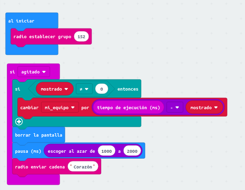
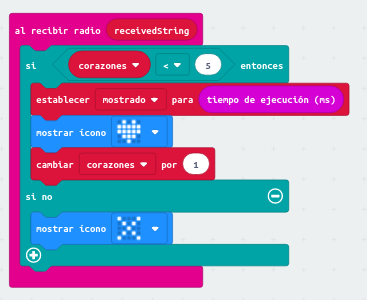
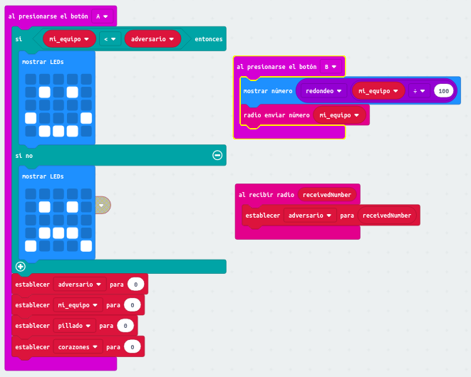

Juego 1: Corazones agitados
===========================

Introducción
------------

Ha llegado la hora de poner en práctica todo lo que has aprendido hasta ahora programando un videojuego en red. Se trata de un juego inspirado en el Shakey Donkey, un juego de micro: bit que usa la radio [^ 1]. 

En nuestro juego participarán dos jugadores, y se medirá lo rápido que reacciona cada jugador cuando aparece un corazón en su micro:bit. El juego comienza al agitar las micro:bits. En el momento en que tu micro:bit muestre un corazón, debes gritar "¡Corazón!" Y agitar tu placa para que desaparezca. Tras borrar el quinto corazón aparecerá un aspa en tu placa. Pulsando el botón B se mostrará el tiempo total de reacción que has tardado. Y pulsando el botón A se mostrará o bien una cara feliz o bien una cara triste, en función del tiempo que tardó tu rival.

Por tanto, en este capítulo practicarás:

1. el concepto de *communicación por grupos*

2. el uso de direcciones *multicast* o *de grupo*

3. el envío y recepción de mensajes

4. con entradas diversas: botones y agitar

5. con el uso de variables y números aleatorios

### Qué vas a necesitar:

    2 micro:bits
    1 pizarra
    rotuladores o notas adhesivas
    1 colega

A programar: jugando a "corazones agitados"
-------------------------------------------

**Descripción:** Para que se pueda jugar por parejas, lo primero que hay que hacer es establecer un ID de grupo único para vuestra pareja. Luego programarás tu placa siguiendo el código que aparece en las imágenes de las siguientes secciones. 

**Instrucciones:** Para establecer los grupos y que sean únicos, una vez elegido el ID escribidlo en la pizarra. 

El juego consiste en agitar las micro:bit cada vez que aparece un corazón en la pantalla y así borrarlo. Así que lo primero que vamos a hacer es programar lo que la placa tiene que hacer al ser agitada:

!!! note ""
	Parte 1: Agitar la micro:bit para borrar el corazón

Si te fijas, en esta primera parte se envía el texto "Corazón". Por tanto es necesario que tengamos un programa que se encarga de gestionar la recepción de un texto. Eso es precisamente lo que se muestra en la siguiente figura:

!!! note ""
	Parte 2: Recibir un mensaje para mostrar un corazón o un aspa

La tercera parte, mostrada en la siguiente figura, se encarga de gestionar lo que ocurre al pulsar el botón B y el botón A. Como ves, en uno de los casos las placas envían un número por radio, así que es necesario un programa que reciba ese número y lo gestione. 

!!! note ""
	Parte 3: Presionar botones B y A para conocer el resultado de la partida

Programa tu placa siguiendo el código mostrado en las imágenes. Una vez listo, jugad varias partidas para comprobar que todo funciona correctamente. Después estudiad el código para intentar entender lo que hace cada programa y contesta las preguntas de los problemas.

Problemas
---------

Let’s first look at Part 1, in the first figure.

1. ¿Qué se almacena en la variable "mi_equipo"?

2. ¿Qué se almacena en la variable "mostrado"?

3. ¿Cómo se actualiza la variable "mi_equipo"?

4. ¿Cómo sabe el programa si tiene que mostrar una cara alegre o una triste? ¿Cómo sabe el tiempo que ha tardado el otro equipo?

5. ¿Por qué siempre jugamos exactamente hasta que aparece el quinto corazón?

6. ¿Que tendría que hacer si quisiera jugar partidas en las que aparecieran 10 corazones?

7. Si quisieras hacer trampa para ganar todas las partidas, ¿cómo "hackearías" el programa para lograrlo?

[^1]: Se trata de un juego creado por David Whale: [Código original](https://twitter.com/whaleygeek/status/834898461912891392?lang=es )
