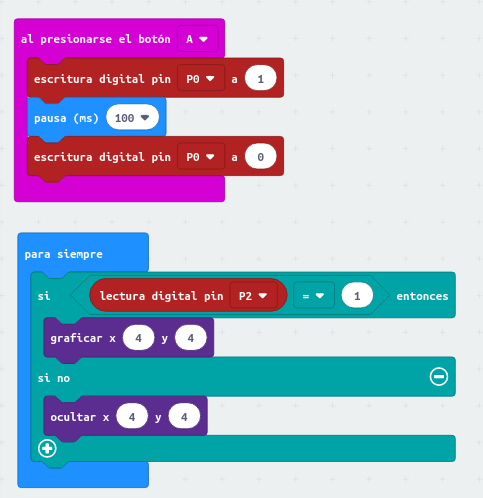

Comunicación usando cables
==========================

Introducción
------------

¡Todo está conectado hoy en día! Ordenadores y dispositvos se conectan entre sí para formar redes. Y estas redes se conectan a su vez entre sí para formar la Internet. Cuando decimos *ordenadores* or *dispositivos*, nos referimos a cualquier cosa, desde un portátil o un teléfono, pasando por una lavadora o un sensor de humedad. Por supuesto, también puede ser tu micro:bit. Y es que, cada vez más, Internet se está convirtiendo en una *Internet de las Cosas* (*Internet of Things* o *IoT*).

En este capítulo vas a crear una red usando cables para conectar micro:bits. Y en el proceso trabajarás los siguientes conceptos:

- *medio de transmisión* y *señales*

- *binario* y *bit*

- *red*

### ¿Qué necesitas?

    2 micro:bits
    4 cables con conector tipo cocodrilo
    1 caja para las pilas y dos pilas AAA
    1 colega

Un poco de teoría...
--------------------

Para que dos micro:bits puedan enviarse mensajes tienen que estar conectadas de algún modo, bien mediante cables o de forma inalámbrica - a esto se le llama *medio de transmisión*.

Un mensaje puede ser un texto como “Hola”, un número como “9”, o un icono de una imagen. Las micro:bits convierten cada mensaje en una señal y la envían a través del *medio de transmisión*.

!!! hint "Definición 1: _Medio de transmisión_"
	Un medio de transmisión es el camino físico sobre el que se transmite una señal. 

!!! hint "Definición 2: _Señal_"
	Las señales son los voltajes electromagnéticos o las ondas que se transmiten en un medio físico cableado o inalámbrico. 

Por ejemplo, pensemos qué ocurre cuando decimos “Hola” a través de un teléfono fijo. El auricular del teléfono convierte los sonidos en una señal de voltaje eléctrico. Luego, esta señal se transmite al teléfono receptor por medio de cables; y en el receptor, se convierte nuevamente en sonido. 

!!! attention "Ejercicio 1"
	¿Cuál es el medio físico que hace posible la comunicación por radio?

Los ordenadores, y también la micro:bit, no pueden procesar señales sin convertirlas en datos binarios: 0s y 1s. Además, los datos binarios procesados por los ordenadores deben convertirse en señales antes de que puedan viajar por un medio de transmisión. 

!!! hint "Definición 3: _Bit_"
	Un bit es la unidad de datos más pequeña en una computadora. Es como un átomo. Un bit puede ser un 1 o un 0.

Un grupo de 8 bits es un *byte*. La Tabla \[tab:bit\] muestra otros ejemplos: 

|**Nombre** | **Tamaño**|
|---------|:--------|
|Byte (B) | 8 bits |
|Kilobyte (KB) | 1024 bytes |
|Megabyte (MB) | 1024 kilobytes |
| Gigabyte (GB) | 1024 megabytes |
| Terabyte (TB) | 1024 gigabytes |

Al conectar ordenadores o dispositivos a través de diferentes medios de transmisión se crean las redes. 

!!! hint "Definición 4: _Red_"
	Una red de ordenadores es una colección de ordenadores o dispositivos que están conectados para poder comunicarse entre sí. En una red de ordenadores hay, por tanto, al menos dos dispositivos. Ademas, dos o más redes pueden conectarse para formar una red más grande: una red de redes. ¡Internet es una red de redes gigante! 

En este capítulo vas a crear una red formada por dos micro:bits que se conectan a través de cables.

Programando mi red de micro:bits
--------------------------------

### Tarea 0: Los pines de la placa micro:bit

Antes de comenzar, como vamos a conectar nuestras micro:bits usando cables, es importante comprender bien para qué se usa cada uno de los pines de conexión. Para ello, lee el artículo [Los "pines" del BBC micro:bit](https://microbit.org/es/guide/hardware/pins/) y contesta las siguientes preguntas: 

- ¿Para qué se usan los pines 0, 1 y 2?
- ¿Para qué se usan los pines GND y 3V?

### Tarea 1: Conecta tus micro:bits y prueba a enviar datos

**Descripción:** Vas a conectar dos micro:bits usando cables, y utilizarás un programa para comprobar que la conexión funciona correctamente. 

**Instrucciones:**  Utilizando cables con conector cocodrilo, conecta el pin 3V entre las dos micro:bits, y conecta también el pin GND. Después, conecta el pin 1 de una micro:bit al pin 2 de la otra placa, y viceversa.  Ten cuidado al conectar los cables: dos de los cables van directos (3V-a-3V y GND-a-GND) pero los otros dos van cruzados (1-a-2 y 2-a-1).

En la figura se muestra un ejemplo. Mira los colores con cuidado (aunque quizá los colores que uses sean diferentes, tienen que hacer la misma conexión).

!!! note ""
	**Figura 1:** Conectar dos micro:bits. Dos de los cabes se conectan de manera directa (3V-a-3V y GND-a-GND) pero los otros dos van cruzados (1-a-2 y 2-a-1)

Para probar la conexión usa el programa de la figura; presiona el botón A en cada micro:bit y verifica que el LED se ilumina en la placa de tu colega. Hay que usar los bloques del menú *Pines*. Este menú está en *Avanzado*. Haz clic en el enlace *Más* para ver todas las opciones.

!!! note ""
	**Figura 2:** Programa para probar la conexión entre dos placas micro:bit Telegraph program. Al presionar el botón A, se envía una señal al otro lado utilizando el Pin 1. El micro:bit receptor escucha en el Pin 2 para verificar si se recibe una señal. Si hay una señal, se ilumina el píxel (4,4) en la pantalla.

Una vez que tengas la red funcionando correctamente contesta las siguientes preguntas:
- ¿Cuántos bits se utilizan para enviar la señal para que la otra placa encienda el píxel (4,4)?
- Sin modificar el funcionamiento actual del botón A, ¿podríamos usar el botón B para enviar otra señal, de manera que se encienda el píxel (4,0) de la otra placa? ¿Cómo? ¿Se puede implementar en las dos placas?
- ¿Cómo habría que modificar el código para que en la micro:bit 2 estuviera encendido el píxel (4,4) mientras se mantuviera el botón A pulsado en micro:bit 1, y que se apagara en micro:bit 2 al soltar el botón 1 en micro:bit 1? Programa esta nueva versión.

### Tarea 2 (extra): "Envío de corazones"

**Descripción:** Vas a intentar replicar el funcionamiento del programa que se muestra en el siguiente vídeo: [Envo de corazones](https://microbit.nominetresearch.uk/networking-book/simple_heart_transfer.html).

**Instrucciones:** 
La micro:bit 1 debe programarse así:
1. Al iniciar muestra un icono de corazón.
2. Cuando se inclina sobre micro:bit 2, envía un pulso a micro:bit 2 sobre el pin correcto y borra el corazón.
3. Cuando micro:bit 1 recibe un pulso en su pin correcto, muestra un icono de corazón.

La micro:bit 2 debe programarse así:
1. Muestra un icono de corazón cuando recibe un pulso en su pin correcto.
2. Cuando se inclina sobre micro:bit 1, envía un pulso a micro:bit 1 sobre el pin correcto y borra el corazón

Avanzado...
-----------

!!! attention "Ejercicio avanzado"
	Echa un ojo a este vídeo [Wired\_pixel\_by\_pixel\_heart.m4v](https://microbit.nominetresearch.uk/networking-book/pixel_heart_transfer.html). Debate con tus colegas de equipo cómo se pueden enviar datos más complejos a través de cables. 

Resources
---------

- Video: What is the Internet (Code.org) -   <https://youtu.be/Dxcc6ycZ73M>

- Video: The Internet: Wires, Cables and Wifi (Code.org) - <https://youtu.be/ZhEf7e4kopM>

- BBC Bitesize, Introducing Binary - <http://www.bbc.co.uk/education/guides/zwsbwmn/revision>

[^1]: This image is by micro:bit Educational Foundation at [www.microbit.org](https://www.microbit.org).

[^2]: Microbit telegraph activity <https://makecode.microbit.org/projects/telegraph/make>  
